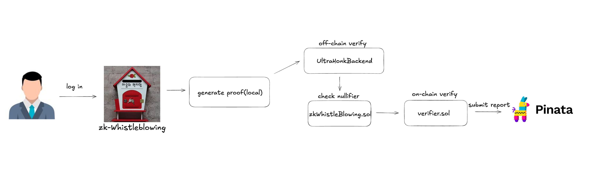
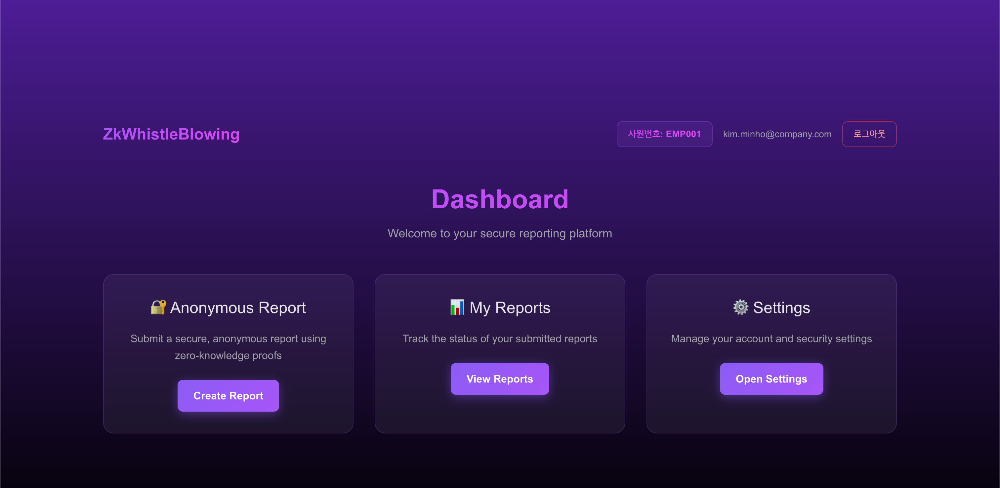
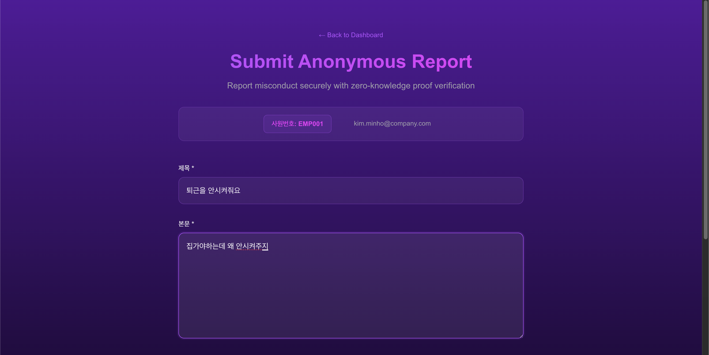

# ZK-Whistleblowing : 익명 내부고발 플랫폼

**익명 내부고발 플랫폼 - Zero-Knowledge Proof 기반 익명성 보장**

ZK-Whistleblowing은 Zero-Knowledge 증명 기술을 활용하여 내부고발자의 익명성을 보장하는 플랫폼입니다. 블록체인과 암호학적 증명을 통해 제보자의 신원을 완벽하게 보호하면서도 제보자가 해당 조직의 구성원임을 검증할 수 있습니다.

## 프로젝트 비전

기업 내부의 부정행위나 비윤리적 행위를 신고하고자 하는 직원들이 보복의 두려움 없이 안전하게 제보할 수 있는 환경을 제공합니다. 최첨단 암호학 기술을 통해 **완전한 익명성**과 **검증 가능한 신뢰성**을 동시에 달성합니다.

## 아키텍처 개요

ZK-Whistleblowing은 3개의 핵심 컴포넌트로 구성되어 있습니다:

1. **Front-end**: 사용자 인터페이스 및 ZK 증명 생성
2. **Noir-circuit**: Zero-Knowledge 증명 회로
3. **ZK-Whistleblowing**: 온체인 검증 및 제보 저장

## 서비스 소개

### 어떻게 작동하나요?

**1단계: 안전한 접근**

- 조직 구성원이 익명으로 내부고발 서비스에 접근
- 신원을 드러내지 않고도 조직의 일원임을 암호학적으로 증명

**2단계: 제보 제출**

- 검증된 사용자가 제보 내용을 분산 저장소(IPFS)에 업로드
- 동시에 블록체인에 제보 사실을 불변 기록으로 저장

**3단계: 투명한 처리**

- 관리자가 전용 페이지를 통해 제보 내용 확인
- 모든 과정이 블록체인에 기록되어 추적 가능

### 왜 기존 시스템과 다른가요?

**문제: 기존 내부고발의 한계**

- 제보자 신원 노출 위험으로 인한 보복 두려움
- 조직이 제보를 임의로 무시하거나 은폐 가능
- 제보 처리 과정의 불투명성

**해결: ZK-Whistleblowing의 혁신**

- **완전한 익명성**: 그 누구도 제보자를 찾을 수 없음
- **강제적 투명성**: 블록체인 기록으로 **제보를 함부로 무시할 수 없음**
- **검증 가능성**: 모든 과정이 공개되고 추적 가능

## 서비스 화면

### 로그인 화면

### 대시보드

### 제보 제출

## 레포지토리 구성

### [front-end](https://github.com/Zk-Whistleblowing/front-end)

**사용자 인터페이스**

- **기술 스택**: Next.js, React, Tailwind CSS, SQLite, IPFS

### [Noir-circuit](https://github.com/Zk-Whistleblowing/Noir-circuit)

**Zero-Knowledge 증명 회로**

- **기술 스택**: Noir, Barretenberg, Poseidon, Indexed Merkle Tree

### [ZK-Whistleblowing](https://github.com/Zk-Whistleblowing/ZK-Whistleblowing)

**블록체인 스마트 컨트랙트**

- **기술 스택**: Solidity, Foundry, Arbitrum, UltraHonk Verifier
